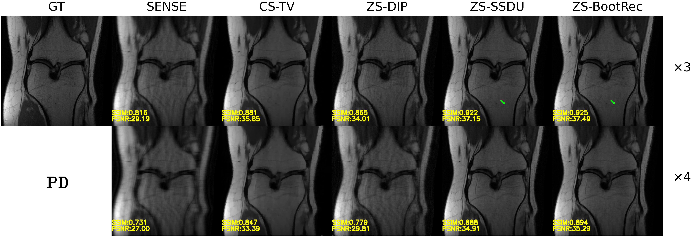
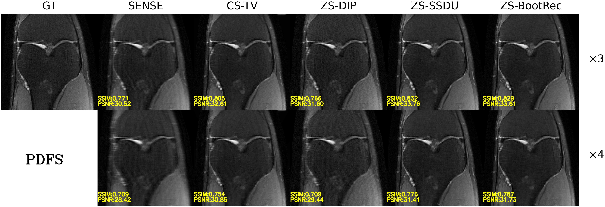

# rep10825984
## Requirements
- fastmri
- torch
- pytorch-lighting
- ...
## Usage
[example data](https://drive.google.com/file/d/10WlIlpawxdgC5TkuuAKmfmgrkVpwLQrN/view?usp=sharing) (data from fastmri validation set and computed coil sensitivity)

### for zero-shot training
```bash
python main_per.py --cfg-path ./bootrec2d_zs_train.yaml
```

## Error Maps for Reference


